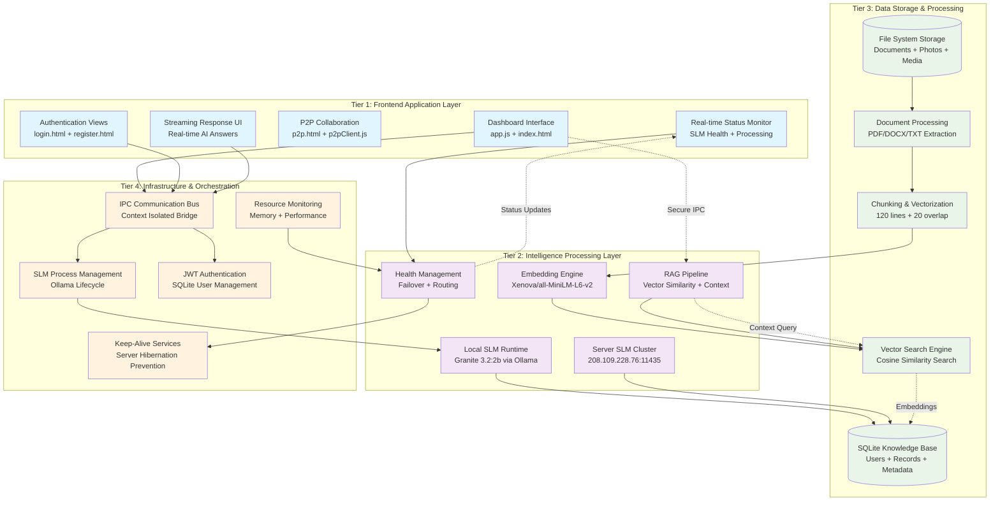

# Family Circle Platform - Architectural Flow Diagram

*Executive-level architectural overview of the intelligent family knowledge platform*

## Executive Summary

Family Circle represents a paradigm shift in document intelligence, delivering an **AI-powered family knowledge platform** that prioritizes **privacy, performance, and seamless user experience**. The system operates through four core architectural flows that transform family documents into an intelligent, queryable knowledge base while maintaining complete data sovereignty.

**Key Architectural Principles:**

- **Privacy-First Intelligence**: Zero external AI dependencies, complete local processing capability
- **Hybrid SLM Architecture**: Seamless orchestration between local (laptop) and server-hosted Small Language Models
- **Anticipatory User Experience**: Documents become instantly queryable through intelligent pre-processing
- **Resource-Conscious Design**: 2B parameter models optimized for consumer hardware

## System Architecture Overview

The Family Circle platform operates as a **four-tier architecture** that seamlessly integrates desktop application frameworks with cutting-edge AI processing capabilities:

### **Tier 1: Frontend Application Layer**

#### Electron-based desktop interface with intelligent user experience

The frontend tier manages user interaction and provides real-time feedback through:

- **Primary Dashboard Interface** - Central hub for document management and Q&A
- **Authentication & User Management** - Secure login with JWT token-based sessions
- **Real-time Status Monitoring** - Live SLM health indicators and processing status
- **Streaming Response Interface** - Real-time AI answers with source citations
- **P2P Collaboration Features** - Multi-user document sharing and group management

### **Tier 2: Intelligence Processing Layer**

#### Hybrid SLM orchestration with local and server-hosted models

The intelligence tier provides AI processing through:

- **Local SLM Runtime** - IBM Granite 3.2:2b (2B parameters) via Ollama on user laptop
- **Server SLM Cluster** - Dedicated Granite models hosted on platform infrastructure
- **Embedding Engine** - Xenova/all-MiniLM-L6-v2 for semantic document understanding
- **RAG Pipeline** - Retrieval-Augmented Generation with vector similarity matching
- **Health Management** - Automatic failover and intelligent model routing

### **Tier 3: Data Storage & Processing**

#### Document intelligence with semantic indexing

The data tier manages document transformation:

- **Document Processing Pipeline** - PDF/DOCX/TXT extraction and normalization
- **Chunking & Vectorization** - Semantic segmentation with 384-dimensional embeddings
- **SQLite Knowledge Base** - User profiles, document metadata, and search indices
- **File System Storage** - User-specific document, photo, and media collections
- **Vector Search Engine** - Cosine similarity-based semantic document retrieval

### **Tier 4: Infrastructure & Orchestration**

#### System lifecycle and service coordination

The infrastructure tier provides:

- **IPC Communication Bus** - Secure inter-process communication with context isolation
- **SLM Process Management** - Automated Ollama lifecycle with health monitoring
- **Keep-Alive Services** - Server hibernation prevention and connection persistence
- **Authentication Layer** - JWT-based security with SQLite user management
- **Resource Monitoring** - Memory optimization and performance tracking

## Core Architectural Flow Patterns

### **Flow 1: Authentication & Application Bootstrap**

The system initialization follows a carefully orchestrated startup sequence that ensures all services are ready before user interaction:

**Initialization Logic:**

1. **Main Process Launch** - Electron application starts with security context isolation
2. **Service Registration** - All IPC handlers are loaded and communication channels established  
3. **SLM Service Startup** - Local Ollama process is started and health-checked
4. **Keep-Alive Activation** - Remote server ping services begin to prevent hibernation
5. **User Authentication** - Secure login with JWT token validation against SQLite database
6. **Dashboard Activation** - Main interface loads with real-time SLM status monitoring
7. **Readiness State** - System enters ready state for document processing and Q&A

**Key Architectural Decisions:**

- **Fail-Safe Startup**: If local SLM fails, system gracefully operates in remote-only mode
- **Security-First Design**: Context isolation prevents renderer from accessing Node.js APIs
- **Service Independence**: Each subsystem starts independently to prevent cascade failures

### **Flow 2: Document Intelligence Pipeline**

The document processing flow transforms uploaded files into intelligent, queryable knowledge through a sophisticated multi-stage pipeline:

**Processing Logic:**

1. **File Upload & Validation** - User selects documents, system validates file types and permissions
2. **Text Extraction** - Specialized parsers extract text from PDF, DOCX, and TXT formats
3. **Content Normalization** - Text cleaning, encoding standardization, and metadata extraction
4. **Intelligent Chunking** - Documents segmented into 120-line chunks with 20-line overlap for context preservation
5. **Embedding Generation** - Each chunk processed through local Transformers.js model to create 384-dimensional vectors
6. **Topic Extraction** - Granite SLM analyzes content to generate human-readable topic summaries
7. **Database Persistence** - Text, embeddings, metadata, and topics stored in SQLite with user association
8. **Readiness Confirmation** - System signals document is immediately available for Q&A

**Key Architectural Decisions:**

- **Upload-Time Processing**: Documents become queryable immediately, eliminating wait times
- **Local Embedding**: Privacy-preserving vector generation using WebAssembly on user device
- **Chunking Strategy**: Optimized for 4K token context windows while preserving semantic continuity
- **Metadata Enrichment**: Automatic topic generation provides semantic navigation aids

### **Flow 3: RAG Question-Answer Intelligence**

The question-answering system demonstrates sophisticated retrieval-augmented generation that combines semantic search with intelligent AI processing:

**Q&A Logic:**

1. **Question Input** - User submits natural language query through interface
2. **Query Vectorization** - Question processed through same embedding model as documents
3. **Semantic Retrieval** - Vector similarity search identifies most relevant document chunks
4. **Context Assembly** - Top-scoring chunks combined with source attribution
5. **Prompt Construction** - Question, context, and instructions assembled for SLM processing  
6. **AI Generation** - Granite model processes query with retrieval context
7. **Streaming Response** - Answer streamed in real-time with source citations
8. **Source Attribution** - Related document sections highlighted with relevance scores

**Key Architectural Decisions:**

- **Hybrid Vector Search**: Combines semantic similarity with user-defined scope filtering
- **Streaming Protocol**: Real-time response delivery prevents perceived latency
- **Source Transparency**: Every answer includes citations to source document sections
- **Context Optimization**: Intelligent chunk ranking maximizes relevant information density

### **Flow 4: SLM Orchestration & Health Management**

The SLM management system provides sophisticated orchestration between local and server-hosted language models:

**Orchestration Logic:**

1. **Health Detection** - Continuous monitoring of local Ollama and remote server availability
2. **Model Selection** - User preference or automatic routing based on performance characteristics
3. **Failover Management** - Automatic switching when primary SLM becomes unavailable  
4. **Resource Optimization** - Memory usage monitoring and process lifecycle management
5. **Keep-Alive Coordination** - Server ping services prevent hibernation of remote resources
6. **Performance Tracking** - Response time monitoring and quality metrics collection
7. **User Notification** - Real-time status updates provide transparency on AI availability

**Key Architectural Decisions:**

- **Graceful Degradation**: System remains functional even when one SLM tier fails
- **Intelligent Routing**: Automatic selection of optimal SLM based on availability and performance
- **Resource Consciousness**: 2B parameter models designed for laptop-class hardware
- **Server Efficiency**: Keep-alive prevents costly cold starts on server infrastructure

## Component Integration Patterns

### **IPC Communication Architecture**

The system employs a sophisticated Inter-Process Communication pattern that maintains security while enabling rich functionality:

**Communication Logic:**

- **Context Bridge Pattern**: Secure API exposure from main process to renderer through preload scripts
- **Channel Isolation**: Separate IPC channels for authentication, documents, AI processing, and system management
- **Async/Promise Integration**: All IPC operations return promises for consistent error handling
- **Event Streaming**: Real-time data flows through dedicated streaming channels for AI responses

### **Data Flow Orchestration**

Information flows through the system in carefully designed patterns that optimize for performance and user experience:

**Flow Logic:**

- **Upload Pipeline**: Documents → Extraction → Chunking → Embeddings → Storage → Readiness
- **Query Pipeline**: Question → Vectorization → Retrieval → Context → AI → Streaming → Display
- **Health Pipeline**: Services → Monitoring → Status → User Interface → Notifications
- **Session Pipeline**: Authentication → Profile → Preferences → State → Persistence

### **Security Boundary Management**

The architecture implements multiple security layers that protect user data while enabling AI functionality:

**Security Logic:**

- **Process Isolation**: Renderer processes cannot access file system or native APIs directly
- **Context Isolation**: WebContents runs in isolated context preventing script injection
- **Local-First Privacy**: Embeddings and core processing happen entirely on user device
- **Server Communication**: Only encrypted communication with authenticated server endpoints
- **Data Sovereignty**: User documents never transmitted to external AI service providers

## Performance & Scalability Patterns

### **Memory Optimization Strategies**

The system implements sophisticated memory management to ensure performance on consumer hardware:

**Optimization Logic:**

- **Lazy Loading**: Embedding models loaded only when needed and cached for session
- **Streaming Processing**: Large documents processed in chunks to prevent memory spikes  
- **Pipeline Reuse**: Single embedding pipeline instance serves all document processing
- **Garbage Collection**: Explicit cleanup of processed chunks and temporary data structures

### **Response Time Optimization**

User experience is optimized through intelligent pre-processing and caching strategies:

**Performance Logic:**

- **Anticipatory Processing**: Latest documents automatically processed for instant availability
- **Vector Cache**: Computed embeddings stored for immediate retrieval
- **Model Warmup**: SLMs kept warm through periodic keep-alive requests
- **Streaming Delivery**: Responses begin streaming before complete generation finishes

### **Scalability Architecture**

The platform scales through intelligent resource management and distributed processing:

**Scalability Logic:**

- **Hybrid Deployment**: Local processing scales with user device capabilities
- **Server Offloading**: Compute-intensive tasks can be delegated to server infrastructure  
- **Model Distribution**: Multiple SLM instances can serve requests based on load
- **Data Partitioning**: User data isolated by authentication for multi-user scalability

## Technical Innovation Highlights

### **Privacy-Preserving AI Architecture**

The platform achieves enterprise-grade AI capabilities while maintaining complete data privacy:

**Innovation Elements:**

- **Zero External Dependencies**: No reliance on OpenAI, Anthropic, or other external AI providers
- **Local Embedding Processing**: Semantic understanding generated entirely on user device
- **Sovereign Data Processing**: Complete document intelligence without data leaving user control
- **Hybrid Model Flexibility**: Optional server processing when enhanced performance is desired

### **Resource-Conscious SLM Design**

The system democratizes AI capabilities by making them accessible on consumer hardware:

**Innovation Elements:**

- **2B Parameter Optimization**: Granite models sized for laptop-class devices (2-4GB RAM)
- **Quantized Processing**: WebAssembly embedding models reduce memory footprint to ~23MB
- **Context Window Optimization**: 4K token windows tuned specifically for family document characteristics
- **Efficient Chunking**: Overlap strategies preserve semantic continuity while optimizing processing

### **Anticipatory User Experience**

The platform eliminates traditional AI application friction through intelligent pre-processing:

**Innovation Elements:**

- **Upload-Time Intelligence**: Documents become queryable immediately upon upload completion
- **Session Warmup**: Most recent documents pre-processed for instant Q&A availability  
- **Streaming Responses**: Real-time answer delivery prevents perceived latency
- **Source Integration**: Every AI response includes transparent citations to source material

## Conclusion

The Family Circle platform represents a sophisticated fusion of modern AI capabilities with privacy-first architecture principles. Through intelligent orchestration of local and server-hosted SLMs, sophisticated document processing pipelines, and anticipatory user experience design, the system delivers enterprise-grade document intelligence while maintaining complete user data sovereignty.

The architecture's four-tier design enables both immediate local processing and enhanced server capabilities, ensuring the platform can serve diverse user needs while scaling efficiently. The system's emphasis on resource consciousness makes advanced AI accessible on consumer hardware, democratizing document intelligence for family and personal use cases.

This architectural approach positions Family Circle as a next-generation platform that bridges the gap between powerful AI capabilities and user privacy requirements, setting a new standard for intelligent document management systems.
