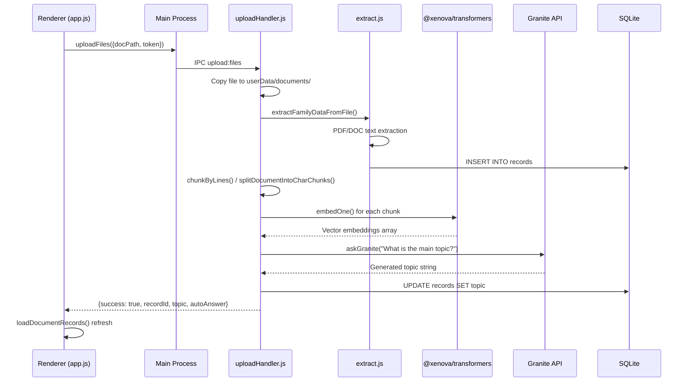
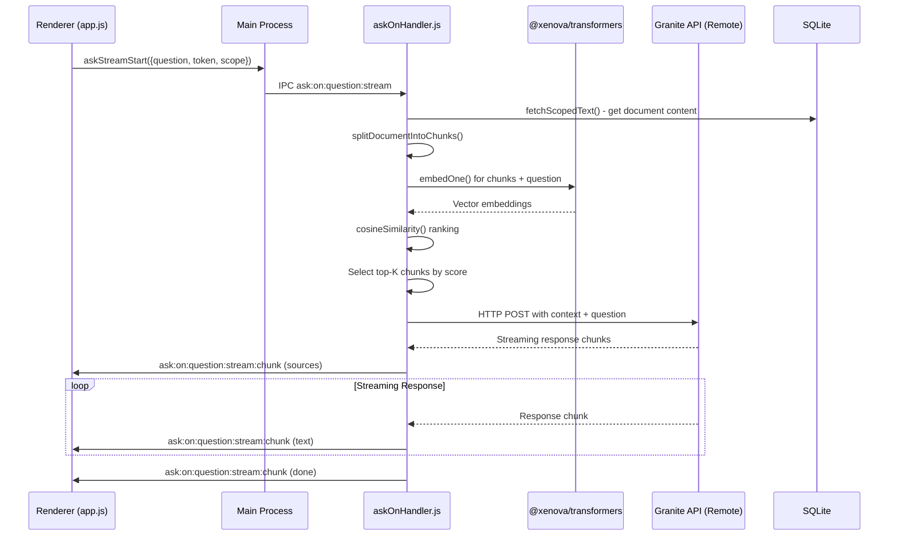
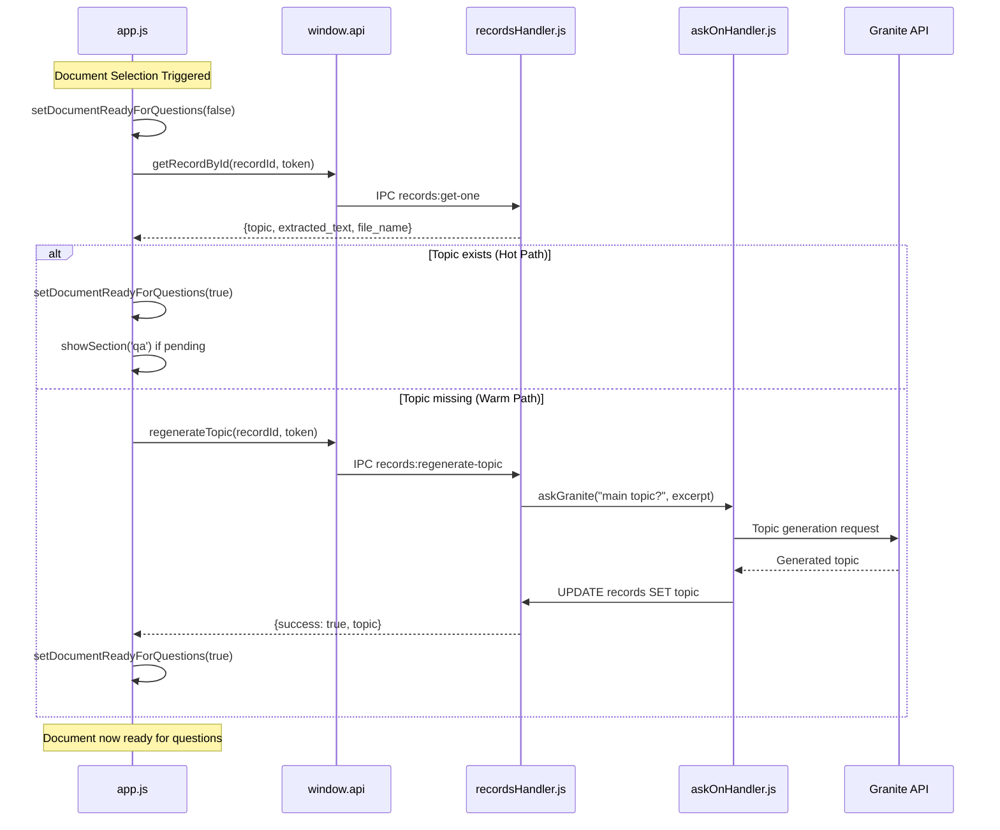
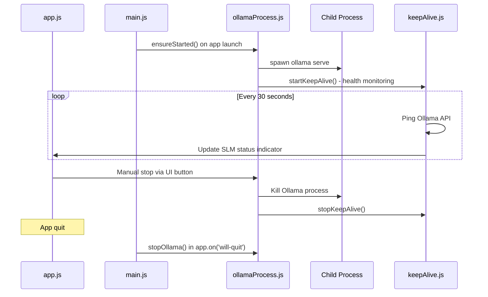
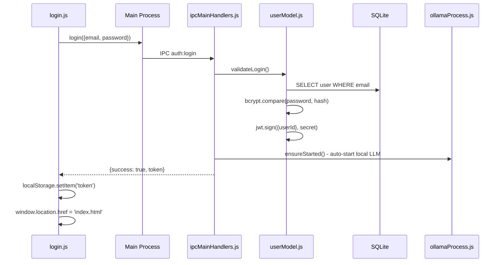
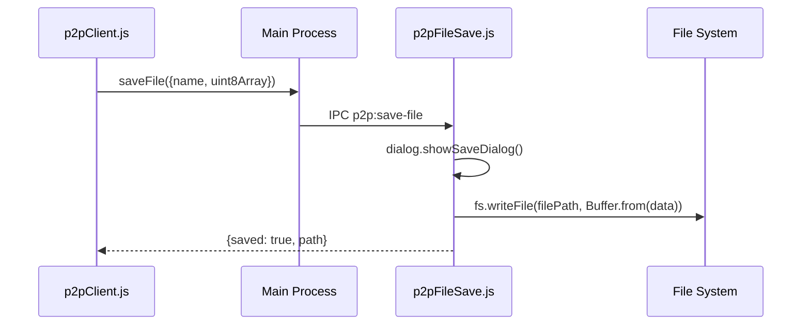

# Family Circle Desktop App - Technical Review

*Comprehensive analysis of the Electron-based RAG (Retrieval-Augmented Generation) document intelligence system*

## Executive Summary

Family Circle is a desktop application built on Electron that serves as an AI-powered document management and query system. The application enables users to upload documents (PDF, DOC, DOCX), automatically processes them through RAG pipelines using local embeddings and remote LLM services, and provides intelligent question-answering capabilities.

**Principal Modules:**

- **Document Processing Engine**: PDF/DOC text extraction with automatic chunking and embedding generation
- **RAG Intelligence Layer**: Local Transformers.js embeddings + remote Granite LLM integration for context-aware responses
- **Multi-Phase Document Preloading**: Anticipatory warm-up system ensuring zero-latency queries
- **Ollama Integration**: Local SLM (Small Language Model) management and lifecycle control
- **SQLite Data Layer**: User management, document storage, and metadata persistence

**Top Risks:**

1. **Native Dependency Fragility**: better-sqlite3 and bcrypt require electron-rebuild, creating deployment complexity
2. **Remote LLM Dependencies**: Critical dependency on external Granite API (208.109.228.76:11435) creates single point of failure
3. **Memory-Intensive Operations**: Transformers.js models and document chunking can consume significant memory with large documents
4. **Embedding Drift**: Local vs remote model version mismatches could affect RAG quality over time

## Tech Stack Overview

### Runtime Environment

- **Electron**: 25.3.1 (Chromium-based desktop framework)
- **Node.js**: v20.11.0 (LTS with ES modules support)
- **Build System**: electron-builder 24.13.1 (NSIS/DMG/AppImage packaging)

### Core Dependencies

```json
{
  "better-sqlite3": "^8.7.0",     // Native SQLite driver
  "bcrypt": "^6.0.0",             // Password hashing (native)
  "@xenova/transformers": "^2.17.2", // Local ML embeddings
  "axios": "^1.11.0",             // HTTP client for LLM APIs
  "jsonwebtoken": "^9.0.2",       // JWT authentication
  "mammoth": "^1.9.1",            // DOCX text extraction
  "pdf-parse": "^1.1.1",          // PDF text extraction
  "multer": "^2.0.2",             // File upload handling
  "uuid": "^11.1.0"               // Unique identifiers
}
```

### State Management

- **Frontend**: Vanilla JavaScript with localStorage persistence
- **Backend**: SQLite with promisified async wrappers
- **IPC Communication**: Electron's contextBridge + ipcRenderer/ipcMain pattern
- **Session Management**: JWT tokens with SQLite user store

### Native Dependencies & Rebuild Requirements

```bash
# Required after installation or Electron version changes
npm run electron-rebuild
# Affects: better-sqlite3, bcrypt (native compilation)
```

## Codebase Structure Map

```
family/
├── src/                          # Electron main process
│   ├── main.js                   # Entry point, window creation, menu setup
│   └── preload.js                # IPC bridge, contextBridge API exposure
├── public/                       # Renderer process (frontend)
│   ├── index.html                # Main SPA shell
│   ├── app.js                    # Core frontend application logic
│   ├── login.html/js             # Authentication UI
│   ├── register.html/js          # User registration
│   ├── styles.css                # Application styling
│   └── js/
│       ├── script.js             # Utility functions
│       └── p2pClient.js          # P2P file transfer client
├── app/                          # Backend business logic
│   ├── database/
│   │   └── db.js                 # SQLite connection, schema, migrations
│   ├── ipc/                      # IPC handlers (main process)
│   │   ├── ipcMainHandlers.js    # Central handler registration
│   │   ├── uploadHandler.js      # Document upload/processing
│   │   ├── recordsHandler.js     # CRUD operations for documents
│   │   ├── askOnHandler.js       # Online RAG queries (Granite LLM)
│   │   ├── askOffHandler.js      # Offline RAG queries (Local Ollama)
│   │   ├── ollamaHandler.js      # Ollama status/lifecycle
│   │   ├── ollamaProcess.js      # Ollama process management
│   │   ├── keepAlive.js          # Health monitoring for services
│   │   └── p2pFileSave.js        # Peer-to-peer file operations
│   ├── model/
│   │   └── userModel.js          # User auth, JWT, profile management
│   ├── helpers/
│   │   └── auth.js               # Authentication utilities
│   └── services/
│       ├── extract.js            # Document text extraction
│       ├── extract2.js           # Enhanced extraction pipeline
│       ├── extract4.js           # Optimized extraction (latest)
│       └── extractN.js           # Experimental extraction methods
├── assets/icons/                 # Application icons (.ico/.icns/.png)
└── package.json                  # Dependencies, build scripts, electron-builder config
```

### Key Startup Flow

```bash
# Application Launch Sequence
1. npm run start
2. electron . (loads src/main.js)
3. main.js requires app/ipc/ipcMainHandlers.js
4. All IPC handlers registered
5. BrowserWindow created with preload.js
6. preload.js exposes window.api via contextBridge
7. public/index.html loads with app.js
8. Auto-authentication check + Ollama warmup
```

## IPC & Boundary Review

### IPC Channel Inventory

| Channel | Direction | Handler File | Payload Schema | Called By |
|---------|-----------|--------------|----------------|-----------|
| `auth:login` | Renderer→Main | ipcMainHandlers.js | `{email, password}` | login.js |
| `auth:register` | Renderer→Main | ipcMainHandlers.js | `{email, password}` | register.js |
| `auth:logout` | Renderer→Main | ipcMainHandlers.js | `{}` | app.js |
| `auth:get-current-user` | Renderer→Main | ipcMainHandlers.js | `token` | app.js |
| `auth:update-profile` | Renderer→Main | ipcMainHandlers.js | `{token, profile}` | app.js |
| `upload:files` | Renderer→Main | uploadHandler.js | `{docPath, photoPaths[], musicPaths[], token}` | app.js |
| `records:get-all` | Renderer→Main | recordsHandler.js | `token` | app.js |
| `records:get-one` | Renderer→Main | recordsHandler.js | `{id, token}` | app.js |
| `records:delete` | Renderer→Main | recordsHandler.js | `{id, token}` | app.js |
| `records:delete-many` | Renderer→Main | recordsHandler.js | `{ids[], token}` | app.js |
| `records:regenerate-topic` | Renderer→Main | recordsHandler.js | `{id, token}` | app.js |
| `ask:on:question` | Renderer→Main | askOnHandler.js | `{question, token, scope, topK?}` | app.js |
| `ask:on:question:stream` | Renderer→Main | askOnHandler.js | `{question, token, scope, topK?}` | app.js |
| `ask:on:question:stream:chunk` | Main→Renderer | askOnHandler.js | `string \| JSON` | Streaming |
| `ask:on:question:stream:error` | Main→Renderer | askOnHandler.js | `string` | Error handling |
| `ask:on:category` | Renderer→Main | askOnHandler.js | `{category, token, scope}` | app.js |
| `ask:on:auto` | Renderer→Main | askOnHandler.js | `{token, scope, question?, topK?}` | app.js |
| `ask:off:question` | Renderer→Main | askOffHandler.js | `{question, token, scope}` | app.js |
| `ask:off:category` | Renderer→Main | askOffHandler.js | `{category, token, scope}` | app.js |
| `ollama:status` | Renderer→Main | ollamaHandler.js | `{}` | app.js |
| `ollama:ensure-started` | Renderer→Main | ollamaHandler.js | `{}` | app.js |
| `ollama:stop` | Renderer→Main | ollamaHandler.js | `{}` | app.js |
| `p2p:save-file` | Renderer→Main | p2pFileSave.js | `{name, data: Buffer}` | p2pClient.js |
| `navigate-to` | Renderer→Main | main.js | `page` | app.js |

### IPC Pattern Analysis

- **Authentication**: JWT token passed in most payloads for stateless auth
- **Error Handling**: Consistent `{success: boolean, error?: string, data?: any}` responses
- **Streaming**: Dedicated channel pair for real-time RAG responses
- **Scope System**: Flexible document targeting (`{type: 'all'|'latest'|'current'|'ids', ids?: number[]}`)

## Key Workflows

### 1. Document Upload & RAG Preparation

**Purpose**: Converts uploaded documents into query-ready embeddings with automatic topic generation

**Entry Points**:

- `public/index.html` file input → `app.js:handleUpload()` → `window.api.uploadFiles()`

**Workflow**:



**Data Models**:

- **Input**: `{docPath: string, photoPaths: string[], musicPaths: string[], token: string}`
- **Output**: `{success: boolean, data: {recordId: number, topic: string, autoAnswer: string}}`
- **Internal**: Document chunks with embeddings stored transiently; only topic persisted to DB

### 2. RAG Query Processing (Online)

**Purpose**: Answers user questions using document context via remote Granite LLM

**Entry Points**:

- `public/app.js:askQuestion()` → `startAskStream()` → `window.api.askStreamStart()`

**Workflow**:



**Data Models**:

- **Question Input**: `{question: string, token: string, scope: ScopeType, topK?: number}`
- **Scope Types**: `{type: 'all'} | {type: 'latest'} | {type: 'current', id: number} | {type: 'ids', ids: number[]}`
- **Stream Chunks**: `string` (raw LLM) | `{type: 'sources', sources: ChunkMeta[]}` | `{type: 'done'}`

### 3. Document Preloading & Readiness System

**Purpose**: Ensures documents are "warm" and ready for instant querying through multi-phase preparation

**Entry Points**:

- Startup: `app.js:runAutoSummaryAtStartup()`
- Selection: `app.js:loadRecordDetails()` → `warmUpDocumentTopic()`

**Workflow**:



**Readiness States**:

- **`__docReadyForQuestions`**: Boolean flag controlling question input availability
- **`__activeLoadToken`**: Race condition prevention for concurrent loads
- **`__pendingNavigateToQA`**: Deferred navigation after warm-up completion

**Preloading Triggers**:

1. **Upload-time**: Automatic topic generation during document processing
2. **Startup**: `runAutoSummaryAtStartup()` warms latest document
3. **Selection**: `loadRecordDetails()` with just-in-time topic regeneration

### 4. Ollama Integration & Local LLM Management

**Purpose**: Manages local Ollama process lifecycle for offline RAG capabilities

**Entry Points**:

- Startup: `main.js` → `ensureStarted()`
- Manual: `app.js` SLM toggle button → `window.api.ensureOllamaStarted()`

**Workflow**:



**Process Management**:

- **Startup**: Auto-launch on app start + login
- **Health Monitoring**: 30-second ping intervals with UI status updates
- **Graceful Shutdown**: Process cleanup on app quit
- **Error Recovery**: Restart on unexpected process death

### 5. User Authentication & Profile Management

**Purpose**: JWT-based stateless authentication with SQLite user storage

**Entry Points**:

- `public/login.html` → `login.js` → `window.api.login()`
- `public/register.html` → `register.js` → `window.api.register()`

**Workflow**:



**Security Features**:

- **bcrypt**: Password hashing with salt rounds
- **JWT**: Stateless authentication with user ID claims
- **Local Storage**: Token persistence across sessions
- **Auto-logout**: Invalid token handling with redirect

### 6. Peer-to-Peer File Transfer

**Purpose**: Simple file save dialog for received P2P files

**Entry Points**:

- `public/js/p2pClient.js` → `window.p2p.saveFile()`

**Implementation**:



**Note**: Current P2P implementation is minimal - only handles file saving via system dialog. No networking protocols or peer discovery implemented.

## Frontend–Backend Coupling Analysis

### Tight Coupling Patterns

1. **Direct API Surface Mapping**:
   - `preload.js` exposes 1:1 mapping of IPC channels as `window.api` methods
   - Frontend directly calls backend function signatures without abstraction layer
   - **Risk**: Backend changes require coordinated frontend updates

2. **Shared State Dependencies**:
   - Token authentication required for most backend operations
   - Document readiness state (`__docReadyForQuestions`) tightly coupled to backend processing status
   - **Evidence**: `app.js` lines 55-75 show UI state directly reflecting backend processing

3. **Error Message Propagation**:
   - Backend error strings directly displayed in frontend UI
   - No error code abstraction or localization layer
   - **Pattern**: `{success: boolean, error: string}` responses rendered as-is

4. **Streaming Protocol Coupling**:
   - Frontend streaming handlers hard-coded to specific event names
   - `ask:on:question:stream:chunk` and `ask:on:question:stream:error` directly consumed
   - **Risk**: Protocol changes break real-time features

### Loose Coupling Evidence

1. **Scope Abstraction**:
   - Document targeting through flexible scope objects allows backend query optimization
   - Frontend doesn't need to understand chunk/embedding internals

2. **Async/Promise Boundaries**:
   - IPC communication naturally creates async boundaries preventing blocking operations
   - Frontend UI remains responsive during heavy backend processing

3. **File System Abstraction**:
   - Frontend never directly accesses file paths or database connections
   - All persistence operations mediated through IPC layer

## Code Complexity & Refactoring Analysis

### Large Files Requiring Decomposition

#### 1. `public/app.js` (1,309 lines) - **CRITICAL REFACTORING NEEDED**

**Current Issues**:

- Monolithic frontend controller handling multiple concerns
- Global state management scattered throughout single file
- UI logic, business logic, and API calls intermixed

**Refactoring Impact**: Changes to document state management require modifications in:

- `public/app.js` (UI state updates)
- `app/ipc/recordsHandler.js` (database operations)
- `app/ipc/uploadHandler.js` (document processing)
- `app/ipc/askOnHandler.js` (RAG readiness checks)

**Suggested Decomposition**:

```javascript
// Proposed structure
public/js/
├── components/
│   ├── DocumentManager.js     // Lines 136-250 (document loading/readiness)
│   ├── QuestionInterface.js   // Lines 1000-1150 (Q&A UI logic)
│   ├── UserProfile.js         // Lines 400-500 (profile management)
│   └── AgentTemplates.js      // Lines 1200-1300 (agent features)
├── services/
│   ├── ApiService.js          // Centralized window.api calls
│   ├── StateManager.js        // Global state (__currentRecordId, etc.)
│   └── StreamingService.js    // Real-time response handling
├── utils/
│   ├── DomUtils.js           // Element manipulation helpers
│   └── ErrorHandling.js      // User-friendly error mapping
└── app.js                     // Main initialization (< 200 lines)
```

#### 2. `app/ipc/uploadHandler.js` (367 lines) - **HIGH PRIORITY**

**Current Issues**:

- File processing, embedding generation, and database operations in single file
- RAG pipeline mixed with upload logic
- Error handling dispersed throughout processing chain

**Cascade Effect Example**: Adding new document format requires changes to:

- `uploadHandler.js` (parsing logic)
- `services/extract.js` (text extraction)  
- `public/app.js` (UI file type validation)
- `database/db.js` (potential schema changes)

**Suggested Decomposition**:

```javascript
app/services/
├── DocumentProcessor.js      // Core text extraction (lines 150-250)
├── EmbeddingService.js       // RAG embedding pipeline (lines 250-320) 
├── TopicGenerator.js         // Topic generation logic (lines 320-350)
└── FileUploadService.js      // File handling orchestration (< 100 lines)
```

#### 3. `app/ipc/askOnHandler.js` (438 lines) - **MEDIUM PRIORITY**

**Current Issues**:

- RAG query processing, embedding generation, and streaming in one file
- Multiple LLM interaction patterns (streaming vs non-streaming)
- Scope handling logic repeated across functions

**Multi-File Impact**: Query interface changes require:

- `askOnHandler.js` (backend processing)
- `public/app.js` (frontend streaming handlers)
- `src/preload.js` (IPC method signatures)
- `public/js/script.js` (streaming UI updates)

**Suggested Decomposition**:

```javascript
app/services/rag/
├── EmbeddingService.js       // Transformers.js operations
├── SimilarityRanker.js       // Cosine similarity + top-K selection
├── ContextBuilder.js         // Chunk assembly + prompt construction
├── StreamingService.js       // Real-time response handling
└── QueryOrchestrator.js      // High-level RAG coordination
```

### Cross-File Dependency Cascades

#### Authentication State Changes

**Single Change Impact**: Modifying JWT token structure affects:

1. **Backend**: `app/model/userModel.js` (token generation)
2. **IPC Layer**: All handlers requiring `decodeToken()` validation
3. **Frontend**: `public/app.js` (token storage/retrieval)
4. **Login Flow**: `public/login.js` + `public/register.js` (token handling)

#### Document Processing Pipeline Changes

**Single Change Impact**: Adding document metadata extraction affects:

1. **Upload**: `app/ipc/uploadHandler.js` (processing pipeline)
2. **Database**: `app/database/db.js` (schema migration)
3. **Records**: `app/ipc/recordsHandler.js` (CRUD operations)
4. **Frontend**: `public/app.js` (UI display logic)
5. **Preload**: `src/preload.js` (API method signatures)

#### Streaming Response Format Changes

**Single Change Impact**: Modifying streaming JSON format affects:

1. **Backend**: `app/ipc/askOnHandler.js` (response generation)
2. **IPC Protocol**: Event payload structure changes
3. **Frontend**: `public/app.js` (streaming parse logic)
4. **Error Handling**: Multiple files for error state management

### Technical Debt Hotspots

#### 1. Global State Management in `app.js`

```javascript
// Current anti-pattern: Global variables scattered throughout file
let __currentRecordId = null;
let __activeRecordMeta = null;
let __docReadyForQuestions = false;
let __modelSelectionAllowsQuestions = false;
let __activeLoadToken = 0;

// Impact: Any component needing document state must modify app.js
```

**Solution**: Centralized state management with observable patterns

#### 2. Repeated IPC Error Handling

```javascript
// Pattern repeated 20+ times across frontend
try {
  const res = await window.api.someOperation(params);
  if (!res.success) {
    showRecordMessage('danger', res.error || 'Operation failed');
    return;
  }
  // Handle success
} catch (e) {
  showRecordMessage('danger', e.message || 'Unknown error');
}
```

**Solution**: Centralized API service with standardized error handling

#### 3. Mixed Concerns in IPC Handlers

```javascript
// uploadHandler.js - File processing + RAG + Database + Topic generation
// Single function handling 4 different concerns (lines 200-367)
```

**Solution**: Separate services following single responsibility principle

### Refactoring Priority Matrix

| File | Lines | Complexity | Change Frequency | Refactor Priority |
|------|-------|------------|------------------|-------------------|
| `public/app.js` | 1,309 | Very High | High | **CRITICAL** |
| `app/ipc/uploadHandler.js` | 367 | High | Medium | **HIGH** |
| `app/ipc/askOnHandler.js` | 438 | High | Medium | **MEDIUM** |
| `app/ipc/recordsHandler.js` | 200 | Medium | Low | LOW |
| `src/preload.js` | 80 | Low | Low | LOW |

### Recommended Refactoring Strategy

1. **Phase 1**: Extract `public/app.js` into component modules (2-3 weeks)
2. **Phase 2**: Decompose `uploadHandler.js` into service layer (1-2 weeks)
3. **Phase 3**: Refactor RAG pipeline in `askOnHandler.js` (1-2 weeks)
4. **Phase 4**: Implement centralized state management (1 week)
5. **Phase 5**: Add comprehensive error handling service (1 week)

<!-- **Total Estimated Effort**: 6-9 weeks with proper testing and migration strategy -->

## RAG Implementation Deep Dive

### Embedding Strategy

**Local Processing**: Uses `@xenova/transformers` with `Xenova/all-MiniLM-L6-v2` model

- **Dimension**: 384-dimensional vectors
- **Quantization**: Enabled for CPU efficiency
- **Caching**: Model downloaded once, cached locally
- **Memory**: ~50MB model footprint per process

**Pipeline**:

```javascript
// app/ipc/askOnHandler.js:35-47
async function getEmbedPipeline() {
  if (__embedPipeline) return __embedPipeline;
  const { pipeline, env } = await import('@xenova/transformers');
  env.allowRemoteModels = true;
  __embedPipeline = await pipeline('feature-extraction', EMBED_MODEL_ID, { quantized: true });
  return __embedPipeline;
}
```

### Chunking Algorithms

**Two-Strategy Approach**:

1. **Line-based chunking** (preferred): `chunkByLines(text, linesPerChunk=15, overlap=3)`
2. **Character-based fallback**: `splitDocumentIntoCharChunks(text, maxTokens=2000, ratio=4)`

**Implementation Logic**:

```javascript
// Adaptive chunking in uploadHandler.js:270-272
let chunks = chunkByLines(text, LINES_PER_CHUNK, LINES_OVERLAP);
if (!chunks || !chunks.length) chunks = splitDocumentIntoCharChunks(text, MAX_TOKENS_PER_CHUNK);
```

### Similarity Scoring

**Cosine Similarity**: Pure JavaScript implementation for CPU efficiency

```javascript
function cosineSimilarity(a, b) {
  const dot = a.reduce((sum, ai, i) => sum + ai * b[i], 0);
  const magA = Math.sqrt(a.reduce((sum, ai) => sum + ai * ai, 0)) || 1;
  const magB = Math.sqrt(b.reduce((sum, bi) => sum + bi * bi, 0)) || 1;
  return dot / (magA * magB);
}
```

### LLM Integration

**Remote Granite API**: Hosted at `208.109.228.76:11435` (Ollama-compatible endpoint)

- **Model**: `granite3.2:2b` (2-billion parameter model)
- **Protocol**: Streaming HTTP with JSON-Lines responses
- **Configuration**: Temperature 0.2, Top-P 0.9, Max tokens 512

**Prompt Engineering**:

```javascript
// askOnHandler.js:356 - RAG prompt template
const prompt = `Answer the question using ONLY this context. Be concise. Do not repeat words or syllables.\n\nCONTEXT:\n${docs.join('\n---\n')}\n\nQUESTION: ${question}\n\nAnswer:`;
```

### Document Readiness Architecture

**Three-Phase Warmup System**:

1. **Upload-time preprocessing**: Immediate chunking, embedding, and topic generation
2. **Session startup warmup**: `runAutoSummaryAtStartup()` prepares latest document
3. **Just-in-time preparation**: `loadRecordDetails()` + `warmUpDocumentTopic()` for user-selected documents

**Readiness Indicators**:

- **Topic presence**: Documents with topics are considered "ready"
- **UI state management**: `__docReadyForQuestions` boolean controls input availability
- **Visual feedback**: Spinner + status messages during preparation

**Prompt Templates Used**:

```javascript
// Topic generation (uploadHandler.js:285)
"What is the main topic of this document? Answer with a document title of at most 10 words."

// Fallback topic extraction (uploadHandler.js:333)
"From the document excerpt below, produce a short, human-friendly topic (max ~7 words)."

// Startup auto-summary (app.js:483)
"What is the main topic of this document? Respond with a title of ten words or fewer."
```

## Database Layer & Storage Architecture

### SQLite Schema

**Users Table**:

```sql
CREATE TABLE users (
    id INTEGER PRIMARY KEY AUTOINCREMENT,
    email TEXT UNIQUE NOT NULL,
    password TEXT NOT NULL,
    -- Profile fields (added via migrations)
    name TEXT,
    phone TEXT,
    age INTEGER,
    dob TEXT,                -- ISO 'YYYY-MM-DD'
    gender TEXT,             -- 'male','female','other','prefer_not_to_say'
    profile_photo_path TEXT, -- local path in userData
    address TEXT
);
```

**Records Table**:

```sql
CREATE TABLE records (
    id INTEGER PRIMARY KEY AUTOINCREMENT,
    user_id INTEGER,
    extracted_text TEXT NOT NULL,
    extracted_json TEXT,
    uploaded_at TEXT DEFAULT CURRENT_TIMESTAMP,
    -- Added via migrations
    file_name TEXT,
    topic TEXT  -- Generated topic for document readiness
);
```

### File Storage Organization

**Directory Structure**:

```
%USERPROFILE%\AppData\Roaming\Family Circle\  (Windows)
├── family.db                              # SQLite database
├── profile_photos/
│   └── user_{userId}.{ext}                # Profile pictures
└── documents/my-data-{userId}/
    └── {originalFileName}                 # Uploaded documents
```

**Storage Paths**:

- **Database**: `app.getPath('userData')/family.db`
- **Documents**: `app.getPath('documents')/Kin-Keepers/Family-Circle/my-data-{userId}/`
- **Photos**: `app.getPath('pictures')/Kin-Keepers/Family-Circle/my-data-{userId}/`
- **Music**: `app.getPath('music')/Kin-Keepers/Family-Circle/my-data-{userId}/`

### Migration System

**Automatic Schema Evolution**:

```javascript
// db.js:44-56 - Column addition with error handling
try {
  const cols = db.prepare(`PRAGMA table_info(records)`).all();
  const hasFileName = cols.some(c => c.name === 'file_name');
  if (!hasFileName) {
    db.prepare(`ALTER TABLE records ADD COLUMN file_name TEXT`).run();
    console.log('✅ Added file_name column to records table');
  }
} catch (e) {
  console.warn('⚠️ Could not add file_name column:', e.message);
}
```

**Promisified Database Interface**:

```javascript
// Async wrappers for better-sqlite3
function getAsync(sql, params = []) { /* ... */ }
function allAsync(sql, params = []) { /* ... */ }
function runAsync(sql, params = []) { /* ... */ }
```

## Ollama Integration Architecture

### Process Lifecycle Management

**Startup Flow**:

1. `main.js` calls `ensureStarted()` on app launch
2. `ollamaProcess.js` spawns `ollama serve` child process  
3. `keepAlive.js` begins health monitoring pings
4. UI status indicator reflects Ollama availability

**Health Monitoring**:

```javascript
// keepAlive.js - 30-second ping cycle
async function pingOllama() {
  try {
    const response = await axios.get(`${SLM_URL}/api/version`, { timeout: 8000 });
    return response.status === 200;
  } catch {
    return false;
  }
}
```

**Graceful Shutdown**:

- App quit event triggers `stopOllama()`
- Child process cleanup with error handling
- Health monitoring stops

### Model Configuration

**Default Settings**:

- **Model**: `granite3.2:2b` (configurable via `SLM_MODEL` env var)
- **Endpoint**: `http://208.109.228.76:11435/api/generate` (configurable via `SLM_URL`)
- **Generation Parameters**:

  ```javascript
  {
    max_tokens: 512,
    temperature: 0.2,
    top_p: 0.9,
    repeat_penalty: 1.25,
    presence_penalty: 0.2,
    frequency_penalty: 0.2,
    stop: ["\n\nCONTEXT:", "\n\nQUESTION:", "\n\nAnswer:", "\n\nContext:"]
  }
  ```

### Offline vs Online RAG

**Online Mode** (`askOnHandler.js`):

- Uses remote Granite API for generation
- Local Transformers.js for embeddings
- Streaming responses for real-time feedback

**Offline Mode** (`askOffHandler.js`):

- Requires local Ollama installation
- Full local processing pipeline
- Fallback when remote services unavailable

## Deployment & Packaging

### Build Configuration

**electron-builder Setup**:

```json
{
  "build": {
    "appId": "com.family.circle",
    "productName": "Family Circle",
    "asarUnpack": [
      "app/database/**",
      "node_modules/better-sqlite3/**"
    ],
    "win": { "target": ["nsis"] },
    "mac": { "target": ["dmg"] },
    "linux": { "target": ["AppImage"] }
  }
}
```

**Critical Packaging Notes**:

- **Native Modules**: better-sqlite3 must be unpackaged from ASAR for proper loading
- **Rebuild Requirements**: `electron-rebuild` needed after dependency installation
- **Icon Assets**: Platform-specific icons in `assets/icons/` directory

### Startup Commands

```bash
# Development
npm start                    # Launches electron . (development mode)

# Production Build
npm run build               # Creates dist/ directory with installers

# Post-Install Setup
npx electron-rebuild        # Rebuilds native dependencies for Electron
```

## Performance Considerations

### Memory Usage Patterns

**Embedding Pipeline**:

- Initial model load: ~50MB RAM for `Xenova/all-MiniLM-L6-v2`
- Per-document processing: ~10-20MB temporary memory per large document
- Embedding cache: Minimal - only stores final 384-dim vectors transiently

**Document Chunking**:

- Large documents (>10MB text) can create hundreds of chunks
- Each chunk generates 384 numbers (1.5KB per embedding)
- Memory scales linearly with document size

### Optimization Strategies

**Lazy Loading**:

- Transformers.js models loaded on first use
- `__embedPipeline` singleton prevents multiple model loads
- Quantization reduces model size by ~50%

**Chunking Efficiency**:

- Line-based chunking preferred for better semantic boundaries
- Character-based fallback for dense content without line breaks
- Configurable chunk size (default 2000 tokens ≈ 8KB text)

**Database Efficiency**:

- SQLite with prepared statements for query optimization
- Async wrappers prevent blocking main thread
- Minimal schema with focused indices

## Application Startup Sequence

### **Startup Sequence for Family Circle App**

#### **1. Initial Command Execution**

```bash
npm start → electron . → src/main.js
```

#### **2. Electron Main Process Initialization (`src/main.js`)**

**Phase A: Load Dependencies & IPC Handlers**

- Loads Electron modules (`BrowserWindow`, `ipcMain`, etc.)
- **Immediately loads ALL IPC handlers** from `app/ipc/ipcMainHandlers.js`
  - Authentication handlers (login, register, logout)
  - File upload handlers
  - Records management
  - Photo/music handlers
  - Ollama integration
- Sets up navigation handler (`navigate-to`)

**Phase B: AI Service Startup**

- **Attempts to start local Ollama server** via `ollamaProcess.js`
  - Checks if Ollama is already running at `http://127.0.0.1:11434`
  - If not running, spawns `ollama serve` process
  - Waits up to 20 seconds for health check
  - Falls back gracefully if Ollama fails to start
- **Starts keep-alive pings** via `keepAlive.js`
  - Immediately pings Granite model at `http://208.109.228.76:11435`
  - Immediately pings embeddings service
  - Sets up 90-minute interval pings to prevent model unloading

**Phase C: Window Creation**

- Creates main BrowserWindow (1000x700px)
- Removes default Electron menu bar for clean UI
- Sets application icon based on platform
- Configures security (context isolation, no node integration)
- Loads preload script (`src/preload.js`)

#### **3. Preload Script Setup (`src/preload.js`)**

- **Exposes secure API bridge** to renderer process via `contextBridge`
- Creates `window.api` object with methods for:
  - Authentication (login, register, logout)
  - File uploads and records management
  - AI questioning (both online/offline modes)
  - Media handling (photos, music)
  - Ollama service control
  - Navigation between pages

#### **4. Initial Page Load**

- **Loads `login.html`** as the entry point
- Sets up login form with validation
- Configures navigation to registration page

#### **5. Database Initialization (`app/database/db.js`)**

- Creates SQLite database in user data directory (`family.db`)
- Auto-creates tables if they don't exist:
  - `users` (id, email, password)
  - `records` (id, user_id, extracted_text, uploaded_at, etc.)
- Runs database migrations to add new columns (`file_name`, `topic`)

#### **6. User Flow After Startup**

**If User Not Authenticated:**

- Shows login page
- On successful login → navigates to `index.html` (main dashboard)
- Stores JWT token in localStorage

**If User Authenticated:**

- `app.js` checks for token on dashboard load
- Loads current user profile
- Initializes all UI components:
  - Document upload interface
  - AI questioning interface
  - Profile management
  - File records display
- Starts periodic status checks for AI models

#### **7. Background Services Running**

- **Ollama local server** (if successfully started)
- **Keep-alive pings** to remote Granite model every 90 minutes
- **SQLite database** ready for queries
- **File upload processing** ready
- **AI question/answer system** ready (both local and remote)

#### **8. Key Environment Variables Used**

- `OLLAMA_HOST` (default: 127.0.0.1)
- `OLLAMA_PORT` (default: 11434)
- `SLM_URL` (remote Granite: <http://208.109.228.76:11435>)
- `SLM_MODEL` (default: granite3.2:2b)
- `KEEP_ALIVE_MS` (default: 90 minutes)

---

## Post-Login Application Flow

After login, the app becomes a **fully functional family data management dashboard** with AI-powered document analysis capabilities. The system intelligently restores the user's previous session state while ensuring all background services are ready for immediate use. The user can immediately start uploading documents, managing their profile, or exploring AI features depending on their needs.

### **Post-Login Flow in Family Circle**

#### **1. Login Success Handling (`login.js`)**

When login is successful:

- **Stores JWT token** in `localStorage.setItem('token', res.token)`
- **Navigates to main dashboard** via `window.api.navigateTo('index.html')`

#### **2. Dashboard Initialization (`app.js` startup)**

**Phase A: Authentication Check**

- **Token validation**: Checks `localStorage.getItem('token')`
- **Redirect if missing**: If no token found, redirects back to `login.html`
- **User loading**: Calls `loadCurrentUser()` to fetch user profile data

**Phase B: State Restoration**

- **Active document recovery**: Checks `localStorage.getItem('activeRecordId')` for previously selected document
- **Global variable setup**: Initializes UI state variables:
  - `__currentUser` - user profile data
  - `__currentRecordId` - last selected document ID
  - `__docReadyForQuestions` - document preparation status
  - `__modelSelectionAllowsQuestions` - AI model selection status

**Phase C: Service Initialization**

- **Ollama monitoring**: Starts `startOllamaWatch()` - polls local AI service every 2 seconds
- **Model state restoration**: Applies saved AI model preference from localStorage
- **Keep-alive status**: Monitors remote AI service connectivity

#### **3. UI Components Activation**

**Phase A: Dashboard View**

- **Shows dashboard section** by default via `showSection('dashboard')`
- **System summary display**: Auto-summary box for latest document insights
- **Navigation setup**: All sidebar navigation becomes functional

**Phase B: Background Data Loading**

- **Profile data fetch**: Loads complete user profile for display
- **Document records**: Preparation for document list (loaded when user navigates to upload section)
- **Agent templates**: Initializes marketplace agent UI components

**Phase C: Interactive Features**

- **File upload handlers**: Ready for PDF/DOC/DOCX uploads
- **AI questioning**: Prepared but requires model selection and document
- **Photo/music upload**: Ready for media file management

#### **4. Real-Time Monitoring Setup**

**AI Service Status**

- **Local Ollama**: Health checks every 2 seconds via `probeOllama()`
- **Remote Granite**: Keep-alive pings every 90 minutes
- **UI indicators**: Status badges show service availability

**Document State Management**

- **Active document tracking**: Maintains selected document across sessions
- **Question readiness**: Monitors document preparation for AI queries
- **Model selection**: Tracks user's AI model preference (local/remote)

#### **5. Feature Readiness States**

**Immediately Available:**

- ✅ Profile management
- ✅ Document upload
- ✅ Photo/music upload
- ✅ Agent marketplace browsing
- ✅ System navigation

**Requires Additional Setup:**

- ⚠️ **AI questioning**: Needs model selection + document upload
- ⚠️ **Document insights**: Needs document processing completion
- ⚠️ **Auto-summaries**: Needs AI service availability

#### **6. User Interaction Flow**

**Typical Next Steps:**

1. **Upload document** → Navigate to "Select Document" → Choose file
2. **Document processing** → Automatic text extraction + AI preparation
3. **Model selection** → Choose "Local/Offline" or "Online Granite"
4. **AI questioning** → Navigate to "Ask a Question" → Type queries

**Or Alternative Flow:**

1. **Profile setup** → Complete user information
2. **Media uploads** → Add photos/music to family collection
3. **Agent exploration** → Browse marketplace features

## Keep-Alive Service Implementation

### **Purpose and Design Intent**

The keep-alive service is a service warming system designed to prevent models from going idle and ensure rapid response times for AI operations.

### **Intended Problem Being Solved**

Ollama models automatically unload from memory after 5 minutes to conserve resources. When a user makes a request after that period, the model must be reloaded from storage, which can causes new delays to reload the document.

### **Dual-Service Architecture**

The keep-alive system maintains two critical remote services:

**Text Generation Service (Granite LLM)**

- Hosted at remote endpoint for answering user questions about documents
- Requires periodic minimal text generation requests to stay warm
- Essential for the Q&A functionality that forms the core user interaction

**Embedding Service (Vector Processing)**

- Required for document similarity search and RAG operations  
- Must process text into vector embeddings for semantic matching
- Both upload processing and question answering depend on this service

### **Timing Strategy**

The system uses a **90-minute interval strategy**.

### **Lifecycle Integration**

**Application Startup**
The keep-alive service starts immediately when the application launches, before the user interface is displayed. This ensures that by the time a user is ready to interact with AI features, the remote services are already warm and responsive.

**Immediate Warm-Up**
Upon startup, the system sends immediate ping requests to both services rather than waiting for the first interval. This approach ensures that users who launch the app with intent to use AI features don't experience cold start delays.
The service operates entirely in the background with no user interface elements. Success and failure events are logged to the console for debugging purposes but don't interrupt the user experience. During application termination, the keep-alive service stops cleanly to prevent orphaned network requests and ensure proper resource cleanup.

The keep-alive service is designed as an **enhancement rather than a requirement**. Network failures, service unavailability, or timeout errors are logged but don't prevent the application from functioning. The system fails gracefully, allowing users to still access all non-AI features and attempt AI operations that may succeed despite keep-alive failures.

### **Integration with Application Architecture**

The keep-alive service integrates with the broader application lifecycle management:

- Coordinates with local Ollama service startup
- Integrates with Electron's app quit events
- Operates independently of user authentication state
- Functions regardless of which application features the user is actively using

---

## Critical Architecture Issue: Keep-Alive vs Document Preloading Integration

### Current Implementation Gap

**Keep-alive and document preloading operate as completely separate, independent systems rather than an integrated workflow.**

#### Keep-Alive System (Global Background Service)

- **Initialized**: App launch in `main.js:65` → `startKeepAlive()`
- **Execution**: Continuous background operation with 90-minute ping intervals
- **Scope**: Global lifecycle (started before window creation, stopped on app quit)
- **Target**: Granite LLM and embedding services (remote endpoints)
- **Purpose**: Prevent models from going idle and triggering cold-start delays

#### Document Preloading System (On-Demand Process)

- **Triggered**: Document selection via `app.js:loadRecordDetails()` → `warmUpDocumentTopic()`
- **Alternative**: Startup via `app.js:runAutoSummaryAtStartup()`
- **Scope**: Activates only when user interacts with documents
- **Target**: Specific document contexts (topic generation, embedding retrieval)
- **Purpose**: Prepare individual documents for instant querying

#### Current Integration (Indirect/Opportunistic)

The systems are **complementary but not integrated**:

1. Keep-alive keeps Granite LLM warm via periodic pings (90-minute intervals)
2. When document preloading runs, the LLM is already responsive
3. Document preloading calls `regenerateTopic()` → `askGranite()` → responds quickly because keep-alive warmed it
4. **Critically**: Document preloading does NOT call or control keep-alive—it merely benefits from its background operation

### Original Design Intent vs Current Implementation

**Original Plan**: Use keep-alive as a **document-specific preloading mechanism**

- Set keep-alive parameter to `-1` or `90m` minutes within Ollama **only for selected documents** to preload them into the LLM model context.
This was to maintain the loaded document in SLM model for 90+ minutes after user interaction and ensure instant response times for document-specific queries by keeping loaded state persistent

**Current Implementation**: Keep-alive as a **generic service warmer**

- Global 90-minute ping interval for all remote services
- No document-specific context preloading
- Services kept warm but documents are regenerated/reloaded on each query
- Misses optimization of keeping frequently-accessed documents pre-cached in model memory.

---

## Glossary

**ASAR**: Electron's archive format for packaging application files

**better-sqlite3**: High-performance Node.js SQLite driver with synchronous API

**Chunking**: Process of splitting documents into smaller, overlapping segments for RAG processing

**Cosine Similarity**: Vector similarity measure used for finding relevant document chunks (range: -1 to 1)

**Electron**: Cross-platform desktop application framework using Chromium and Node.js

**Embeddings**: High-dimensional vector representations of text for semantic similarity calculations

**Granite LLM**: IBM's family of large language models, particularly granite3.2:2b (2-billion parameters)

**IPC (Inter-Process Communication)**: Electron's system for communication between main and renderer processes

**JWT (JSON Web Token)**: Stateless authentication tokens containing encoded user claims

**Ollama**: Local LLM runtime for serving language models with OpenAI-compatible APIs

**Preload Script**: Electron security layer that exposes controlled APIs to renderer process via contextBridge

**RAG (Retrieval-Augmented Generation)**: AI technique combining document retrieval with language generation

**Scope Object**: Flexible targeting system for specifying which documents to query (`{type: 'all'|'latest'|'current'|'ids'}`)

**SLM (Small Language Model)**: Lightweight language models optimized for local execution

**Top-K Retrieval**: Selection of the K most relevant document chunks based on similarity scores

**Transformers.js**: JavaScript implementation of Hugging Face transformers for browser/Node.js embedding generation

**Vector Database**: Storage system optimized for high-dimensional vector similarity search (not implemented - uses in-memory processing)

*This technical review provides comprehensive analysis of the Family Circle application architecture, implementation patterns, and operational characteristics as of November 2025.*
